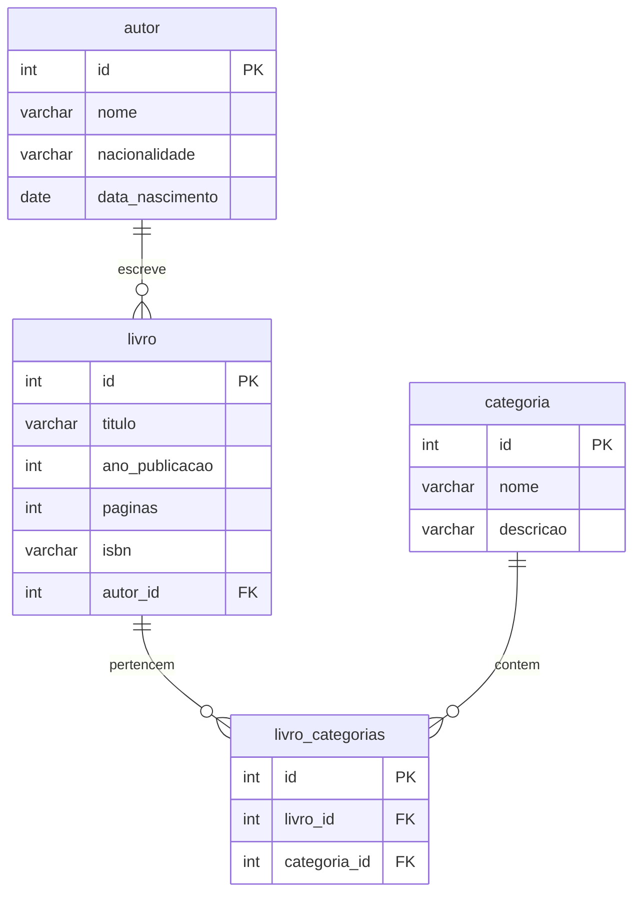

Exemplo de modelagem lógica:

```mermaid
erDiagram
    autor {
        int id PK
        varchar nome
        varchar nacionalidade
        date data_nascimento
    }
    livro {
        int id PK
        varchar titulo
        int ano_publicacao
        int paginas
        varchar isbn
        int autor_id FK
    }
    categoria {
        int id PK
        varchar nome
        varchar descricao   
    }
    livro_categorias {
        int id PK
        int livro_id FK
        int categoria_id FK
    }
    
    autor ||--o{ livro : "escreve"

    livro ||--o{ livro_categorias : "pertencem"

    categoria ||--o{ livro_categorias : "contem"
```
